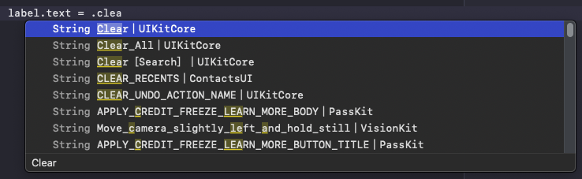

SystemStrings
=============

*Mirrors: [GitHub] ~ [GitLab]*

A Swift package that exposes localized strings from iOS system
frameworks for reuse.

Features
--------

*No dependencies*

SystemStrings does not require any non-system dependencies

*Stand-alone files*

Only interested in `UIKit` strings? Simply copy
[UIKitStrings.swift](Sources/SystemStrings/UIKitStrings.swift) directly
into your project and profit. Every file in SystemStrings is stand-alone
and can be used without requiring any of the other files in the package.

*Discoverable strings*

Existing system strings are easy to find because keys are translated
into identifiers by means of human-readable unicode characters

Caveats
-------

SystemStrings loads translations from bundles *at runtime*. This
requires each used bundle to be linked and loaded which comes with a
certain perfomance penalty.

The strings in system bundles can change between iOS versions. The
SystemStrings code was generated using the latest available version of
iOS at the time. There is no guarantee that all strings will be
available on past or future iOS versions though.

Available Strings
-----------------

Below is a list of the supported frameworks and their associated number
of localized strings.

    Accounts                20
    ARKit                   71
    AudioToolbox            291
    AVFoundation            195
    AVKit                   38
    BusinessChat            34
    ClassKit                37
    CloudKit                233
    Contacts                376
    ContactsUI              543
    CoreAudioKit            46
    CoreBluetooth           4
    CoreData                38
    CoreImage               839
    CoreLocation            33
    CoreMIDI                2
    CoreSpotlight           496
    CoreTelephony           64
    CryptoTokenKit          1
    EventKit                51
    EventKitUI              577
    ExposureNotification    8
    ExternalAccessory       1
    FileProvider            100
    FileProviderUI          27
    Foundation              2114
    HealthKit               948
    HomeKit                 389
    iAd                     27
    IdentityLookupUI        6
    ImageCaptureCore        39
    Intents                 94
    IntentsUI               5
    LinkPresentation        89
    MapKit                  360
    MediaPlayer             138
    MessageUI               166
    MultipeerConnectivity   17
    NetworkExtension        133
    PassKit                 3327
    PDFKit                  108
    PencilKit               106
    PhotosUI                669
    QuickLook               49
    ReplayKit               106
    SafariServices          677
    Social                  156
    StoreKit                17
    UIKit                   421
    VideoSubscriberAccount  181
    VisionKit               107
    WatchConnectivity       39

Contributing
------------

To regenerate the code run `swift package generate-xcodeproj` and then
execute the tests from Xcode. Alternatively you can also run the tests
from the command line, e.g. via

    xcodebuild test -scheme "SystemStrings-Package" -destination "name=iPhone 11"

License
-------

SystemStrings is licensed under the Apache License, Version 2.0.

  [GitHub]: https://github.com/Johennes/swift-systemstrings
  [GitLab]: https://gitlab.com/cherrypicker/swift-systemstrings
